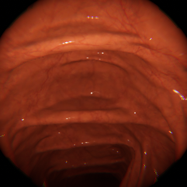

## 🚀 Running the Project

### 🏋️‍♂️ Train and Evaluate the Model

Run the following commands to train the depth estimation model and evaluate it:

```bash
python3 new_model.py \
  --image_dir [PATH TO RGB TRAINING IMAGES] \
  --depth_dir [PATH TO TRAINING DEPTH CHART IMAGES] \
  --epochs [NUMBER OF EPOCHS] \
  --batch_size [BATCH SIZE]

python3 eval_model.py \
  --model_path [PATH TO SAVED MODEL] \
  --image_dir [PATH TO RGB EVAL IMAGES] \
  --depth_dir [PATH TO EVAL DEPTH CHART IMAGES] \
  --output_dir [PATH TO RESULTS DIRECTORY]
```
## 🧠 Code Overview
This section explains the functionality of the key scripts in this repository.

### 📄 new_model.py
Trains a self-supervised monocular depth estimation model using endoscopic RGB video frames.

**Arguments:**

* --``image_dir``: Path to RGB training images.

* --``depth_dir``: Path to corresponding ground-truth depth charts (optional, for validation).

* --``epochs``: Number of training epochs.

* --``batch_size``: Number of images per batch.

**Functionality:**

* Loads image and depth data.

* Builds and trains a convolutional neural network to predict per-pixel depth.

* Implements self-supervised loss functions:

* Photometric loss between adjacent frames.

* Smoothness loss to regularize depth output.

* Saves model checkpoints during training.

### 📄 eval_model.py
Evaluates a trained depth estimation model and saves predicted depth maps.

**Arguments:**

* ``--model_path``: Path to the saved model checkpoint (.pth file).

* ``--image_dir``: Directory of RGB evaluation images.

* ``--depth_dir``: Directory of ground-truth depth maps for evaluation.

* ``--output_dir``: Destination folder for saving predicted depth images and plots.

**Functionality:**

* Loads a pretrained model.

* Performs forward passes on evaluation images.

* Compares predictions to ground truth using common metrics:

  * RMSE

  * Abs Rel

  * Sq Rel

* Saves output depth maps for visualization and analysis.

## Data Examples
**Example RGB Image**



**Example Depth Chart Image**


